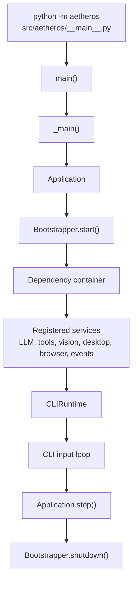
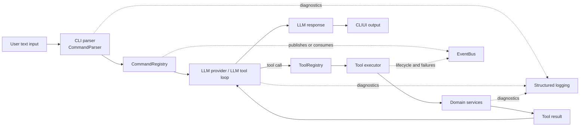
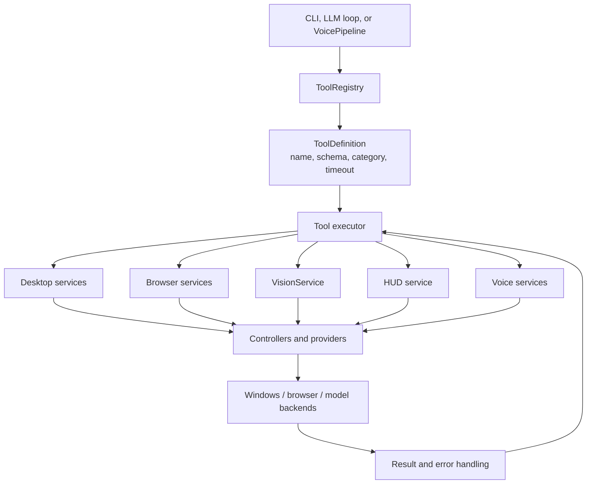
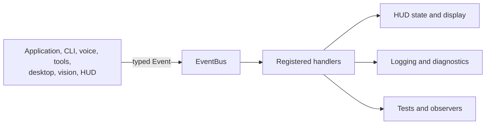
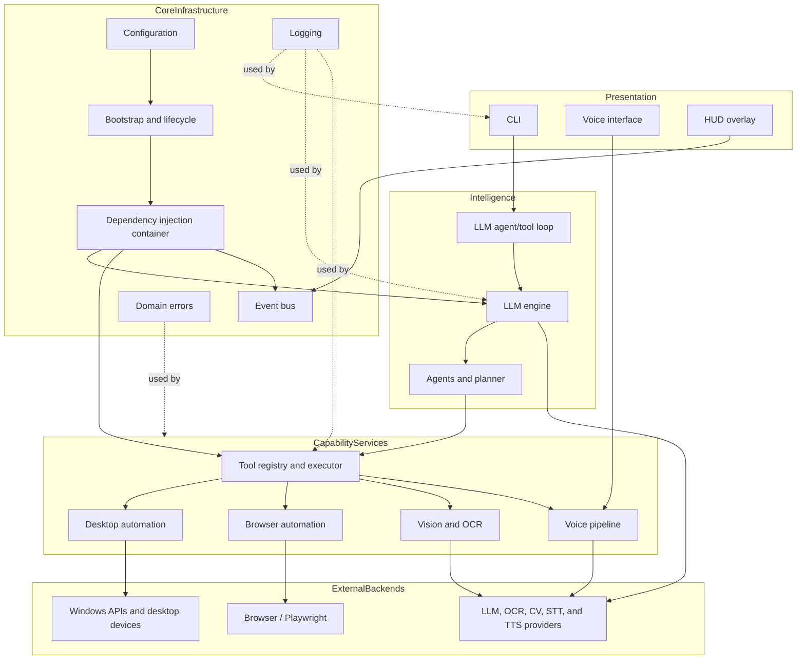
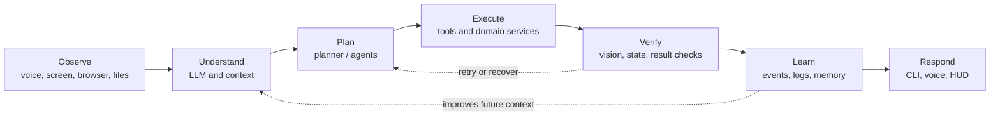

# AetherOS Project Flow Diagram

This document provides a high-level view of the current AetherOS runtime and
the main subsystem boundaries. The diagrams use Mermaid, so they render in
GitHub, VS Code extensions, and most Markdown documentation tools.

## How One User Request Works

Example request:

```text
ask open Notepad
```

The actual runtime behavior is:

```mermaid
sequenceDiagram
    actor User
    participant CLI as CLIRuntime
    participant Parser as CommandParser
    participant Commands as CommandRegistry
    participant Loop as LLMToolLoop
    participant Model as LLM provider
    participant Registry as ToolRegistry
    participant Executor as ToolExecutor
    participant Service as Desktop service
    participant OS as Windows

    User->>CLI: Enter "ask open Notepad"
    CLI->>Parser: Parse input
    Parser-->>CLI: ParsedCommand(name="ask", args=[...])
    CLI->>Commands: Execute parsed command
    Commands->>Loop: run_detailed(prompt)
    Loop->>Model: Send prompt + enabled tool schemas

    alt Model answers without using a tool
        Model-->>Loop: Final text response
    else Model requests a tool
        Model-->>Loop: Tool call, for example launch_application
        Loop->>Registry: Resolve tool
        Registry-->>Loop: ToolDefinition
        Loop->>Executor: execute_safe(name, arguments)
        Executor->>Executor: Check tool exists and is enabled
        Executor->>Executor: Validate arguments
        Executor->>Service: Invoke registered function
        Service->>OS: Perform desktop action
        OS-->>Service: Action result
        Service-->>Executor: Value or error
        Executor-->>Loop: ToolExecutionResult
        Loop->>Model: Add tool result to conversation
        Model-->>Loop: Final answer or another tool call
    end

    Loop-->>Commands: AgentLoopResult
    Commands-->>CLI: Format answer
    CLI-->>User: Print final response
```

### Request steps in plain language

1. `__main__.py` creates `Application`.
2. `Application.start()` asks `Bootstrapper` to initialize configuration,
   logging, dependency injection, events, services, tools, and the LLM.
3. `Application` creates `CLIRuntime` with the registered tools and LLM tool
   loop.
4. The CLI reads a line and `CommandParser` converts it into a command.
5. `CommandRegistry` routes `ask` to the LLM tool loop.
6. The LLM receives the user message and the schemas of enabled tools.
7. If the LLM needs to act, it returns a tool call.
8. `ToolRegistry` finds the tool and `ToolExecutor` checks, validates, and runs
   it with a timeout.
9. The tool result is sent back to the LLM as an observation.
10. The LLM can request another tool or return a final answer.
11. The CLI displays the final answer to the user.

Tool failures are normally returned to the LLM as data, allowing it to recover
or explain the failure instead of crashing the whole CLI session.

## 1. Application Startup and Shutdown



## 2. Main Text Request Flow



## 3. Voice Interaction Flow

The voice pipeline is implemented as a stateful turn:
`LISTENING → TRANSCRIBING → THINKING → EXECUTING → SPEAKING → IDLE`.
Typed text can enter the same pipeline through `VoicePipeline.say()`, which
skips microphone capture and speech recognition.

```mermaid
flowchart TD
    Trigger["Voice hotkey or typed text"]
    Capture["AudioCapture<br/>(voice input only)"]
    STT["Speech-to-text provider"]
    Transcript["Transcript"]
    Pipeline["VoicePipeline"]
    Reasoner["VoiceReasoner / LLM"]
    Registry["ToolRegistry"]
    ToolExec["Tool execution"]
    Events["EventBus"]
    TTS["Text-to-speech provider"]
    HUD["HUD subscribers"]
    Result["TurnResult"]

    Trigger --> Capture
    Capture --> STT --> Transcript --> Pipeline
    Trigger -->|say(text)| Pipeline
    Pipeline --> Reasoner
    Reasoner -->|optional tool calls| Registry --> ToolExec --> Reasoner
    Reasoner --> TTS --> Result

    Pipeline -. state and lifecycle events .-> Events
    ToolExec -. execution events .-> Events
    Events --> HUD
```

## 4. Tool Execution and Domain Adapters

All high-level callers resolve capabilities through the central
`ToolRegistry`. Domain services then delegate to provider or controller
implementations rather than exposing low-level libraries directly.



## 5. Event-Driven Communication

The event bus keeps subsystems decoupled. Producers publish typed events, and
subscribers receive them without the producer directly importing or calling
the consumer.



## 6. Subsystem Map



## 7. Intended Long-Term Workflow

The repository documentation describes a broader autonomous workflow. This is
the target architecture and should not be confused with every step being
implemented in the current source tree.



## Source References

- `src/aetheros/__main__.py` — process entry point.
- `src/aetheros/bootstrap/application.py` — application lifecycle.
- `src/aetheros/cli/main.py` — interactive CLI runtime.
- `src/aetheros/tools/registry.py` — central tool registry.
- `src/aetheros/llm/agent_loop.py` — LLM/tool interaction loop.
- `src/aetheros/voice/pipeline.py` — voice turn state machine.
- `src/aetheros/runtime/events/event_bus.py` — typed event publishing.
- `src/aetheros/vision/controller.py` — OCR, CV, detection, and matching.
- `docs/02_ARCHITECTURE_01.md` — architectural principles.
- `docs/05_RUNTIME_FLOW_01.md` — intended request lifecycle.
