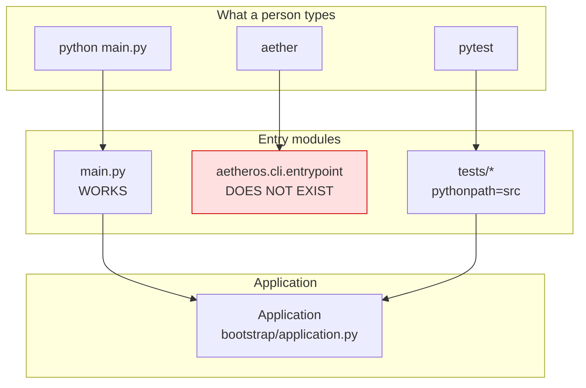
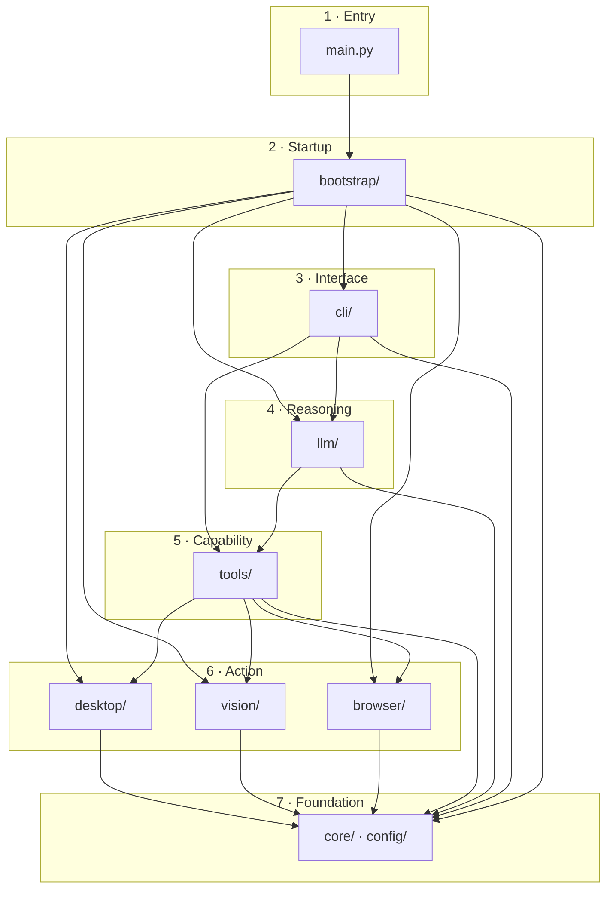
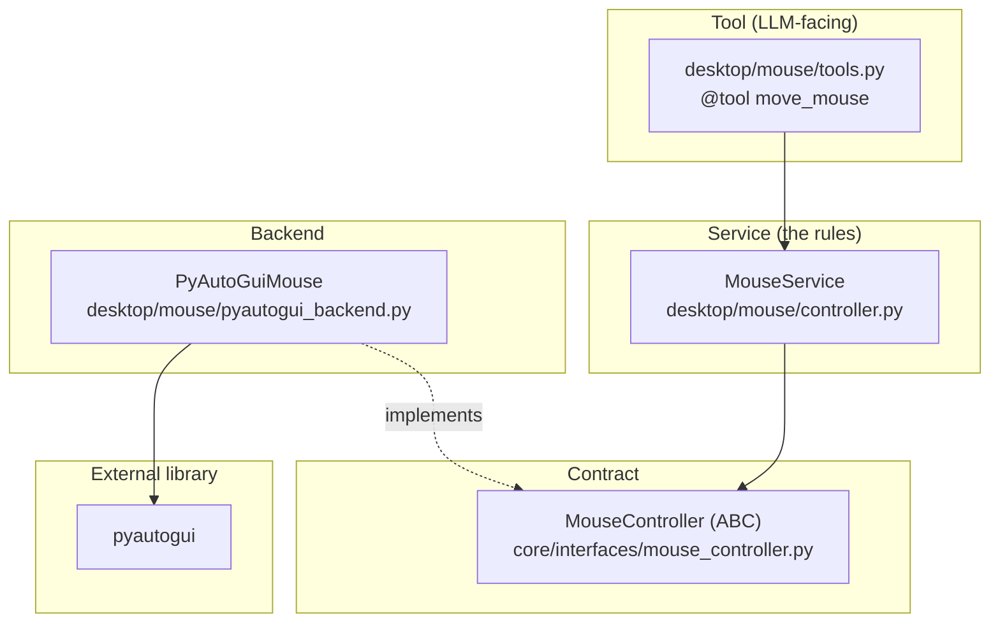
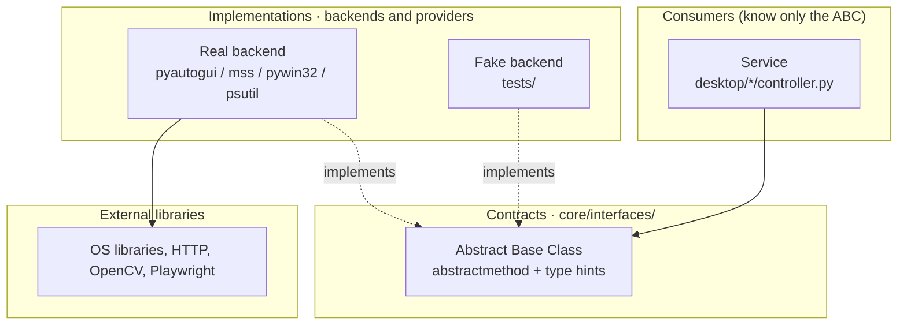
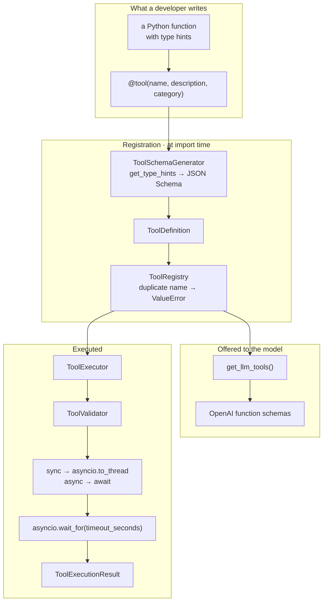
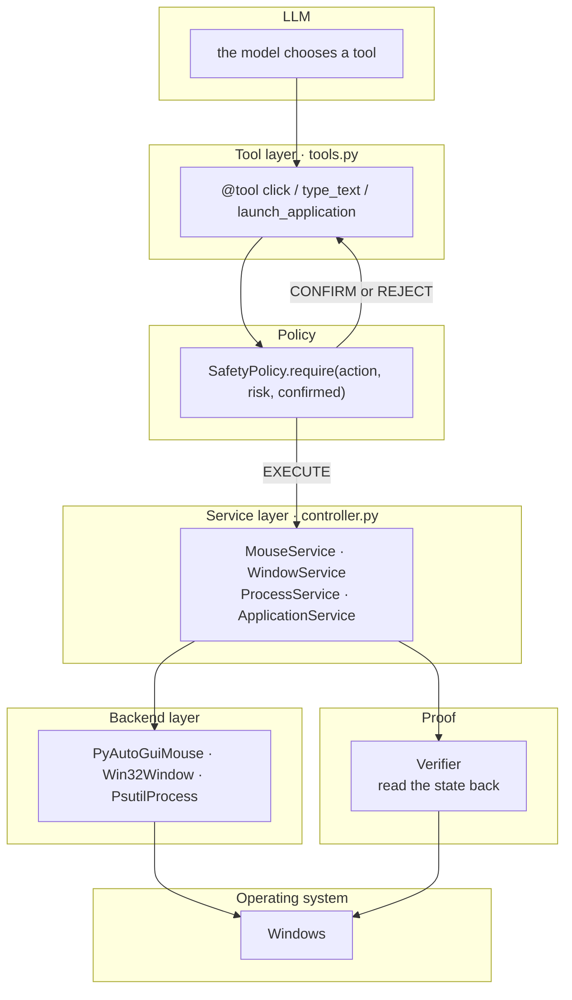
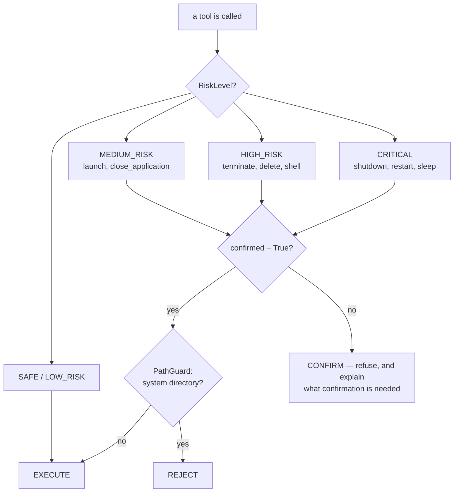
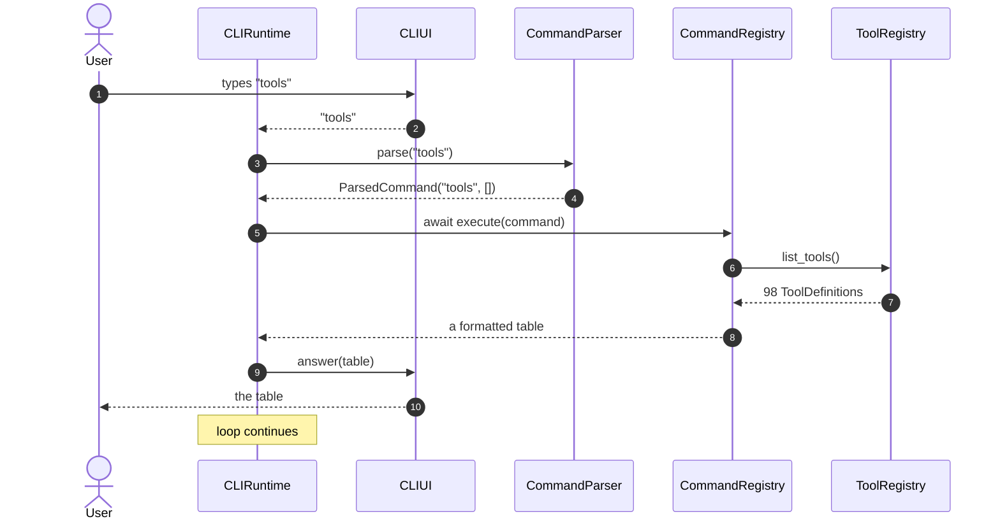
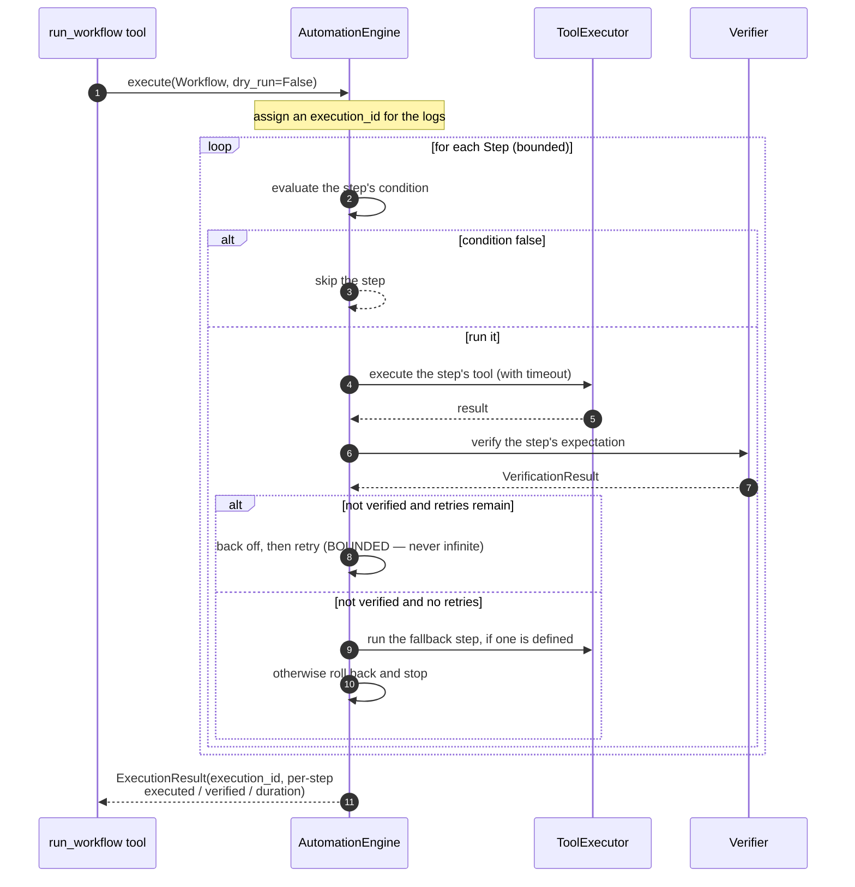

# AetherOS — Codebase Guide

> **Who this is for:** someone who has just cloned this repository and wants to
> understand how it actually works, from the moment you type `python main.py` to
> the moment a mouse moves on screen.
>
> **How to read it:** sections 1–4 give you the mental model. Section 5 is the
> reference you come back to (every important component lists its *file
> location*, *purpose*, *who calls it*, and *what it calls*). Sections 6–10 are
> the pictures.
>
> This document describes the code **as it exists today**, including the parts
> that are written but not yet wired up. Where something is incomplete it says
> so plainly — see [Section 11: Known gaps and gotchas](#11-known-gaps-and-gotchas).

---

## Table of contents

1. [Project purpose](#1-project-purpose)
2. [High-level folder structure](#2-high-level-folder-structure)
3. [Application entry points](#3-application-entry-points)
4. [Main execution flow](#4-main-execution-flow)
5. [Core components and their responsibilities](#5-core-components-and-their-responsibilities)
6. [Dependency relationships](#6-dependency-relationships)
7. [Data flow through the application](#7-data-flow-through-the-application)
8. [Important interfaces and implementations](#8-important-interfaces-and-implementations)
9. [Visual architecture diagrams](#9-visual-architecture-diagrams)
10. [Visual sequence diagrams](#10-visual-sequence-diagrams)
11. [Known gaps and gotchas](#11-known-gaps-and-gotchas)
12. [Glossary](#12-glossary)

---

## 1. Project purpose

### 1.1 What AetherOS is meant to be

AetherOS is designed as an **autonomous Trading Intelligence and Decision
Support System**. Its stated mission (see `CLAUDE.md` at the repository root) is
to analyse financial markets and produce *evidence-based*, *probabilistic*,
*auditable* trading intelligence — never a chatbot-style guess.

The intended output of the finished system looks like this:

```text
RELIANCE

Signal:      BULLISH
Probability: UP 78% | SIDEWAYS 14% | DOWN 8%
Horizon:     1 trading day
Confidence:  HIGH
Risk:        MEDIUM

Evidence:
- Price above major moving averages
- Positive momentum
- Increasing volume
```

Every number in that report is meant to be traceable back to a calculation, a
data source, and a model version — not invented by a language model.

### 1.2 What AetherOS is *right now*

This is the single most important thing for a newcomer to understand:

> **The trading brain does not exist yet. What exists is the machine that will
> run it.**

What has actually been built is a **general-purpose autonomous computer
operator**: a Large Language Model (LLM) wired to ~98 real, executable tools
that can drive the mouse, keyboard, clipboard, screen, windows, processes,
applications, a web browser, and computer vision — all behind a safety policy,
a verification system, and a workflow engine.

Think of it as the *hands, eyes and reflexes*. The trading-analysis *mind* —
market data, indicators, quant models, probability calibration, backtesting,
risk — is described in `CLAUDE.md` and `docs/ROADMAP/` but is not implemented.

So today, AetherOS is best described as:

```text
A safe, verifiable, LLM-driven desktop and browser automation platform,
built to later host a trading-intelligence core.
```

### 1.3 The three design rules that explain most of the code

If a piece of code surprises you, it is probably one of these three rules:

| Rule | What it means in practice |
| ---  |        ---                |
| **Layers, always** | Nothing skips a layer. A tool never touches PyAutoGUI; it calls a *service*, which calls a *backend*, which calls the library. See [Section 8](#8-important-interfaces-and-implementations). |
| **Never lie about success** | If an action might not have worked, the code *reads the state back* and reports what it found. A "terminated" process that is still alive is reported as `still_running: true`, not as success. |
| **Dangerous things need permission** | Deleting, shelling out, terminating, powering off — all pass through a `SafetyPolicy` that can demand explicit confirmation or refuse outright. |

---

## 2. High-level folder structure

### 2.1 The repository root

```text
AetherOS/
├── main.py              ← THE working entry point. Start here.
├── pyproject.toml       ← dependencies, pytest config, tool config
├── requirements.txt
├── CLAUDE.md            ← the project constitution (mission + rules)
├── README.md
├── docs/                ← documentation (this file lives here)
├── src/aetheros/        ← ALL application code
├── tests/               ← pytest suite
├── venv/ , venv312/     ← local virtual environments
└── yolo11n.pt           ← optional YOLO object-detection weights
```

### 2.2 Inside `src/aetheros/` — the packages that matter

```text
src/aetheros/
│
├── bootstrap/     ← STARTUP. Builds and wires the whole application.
│   ├── application.py    Application  — lifecycle: start / run / stop
│   ├── bootstrapper.py   Bootstrapper — the 12-step wiring chain
│   └── lifecycle.py      LifecycleManager (written, not yet wired)
│
├── cli/           ← The user's front door: an interactive terminal.
│   ├── main.py           CLIRuntime  — the read-eval-print loop
│   ├── ui.py             CLIUI       — printing, prompting, the logo
│   ├── parser.py         CommandParser — "ask hello" → (ask, [hello])
│   ├── commands.py       CommandRegistry — every command handler
│   └── tool_commands.py  ToolCommandService — run a tool by hand
│
├── config/        ← Settings from environment variables / .env
│   └── settings.py       Settings (pydantic-settings)
│
├── core/          ← Shared foundations. Depends on nothing above it.
│   ├── container/        ServiceContainer — dependency injection
│   ├── interfaces/       10 abstract base classes (the contracts)
│   ├── errors/           BaseError + one error type per domain
│   └── logging/          get_logger / setup_logging (loguru)
│
├── tools/         ← The tool system: how capabilities reach the LLM.
│   ├── registry.py       ToolRegistry + @tool decorator
│   ├── executor.py       ToolExecutor — validate, run, time out
│   ├── schema.py         ToolSchemaGenerator — Python → JSON schema
│   ├── validator.py      ToolValidator — argument checking
│   └── discovery.py      ToolDiscovery — import tool modules
│
├── llm/           ← The reasoning layer.
│   ├── agent_loop.py     LLMToolLoop — the think → act → observe loop
│   ├── engine.py         LLMEngine   — provider + tool schemas
│   ├── providers/        OpenAICompatibleProvider (Ollama/OpenAI/…)
│   ├── tool_calls.py     parse_llm_response — tolerant JSON parsing
│   ├── tool_schema.py    get_llm_tools — registry → OpenAI schemas
│   ├── config.py         LLMConfig.from_env()
│   └── manager.py        LLMProviderManager — multiple providers
│
├── desktop/       ← Everything that touches the operating system.
│   ├── mouse/ keyboard/ clipboard/ screen/   (input & output)
│   ├── window/ process/ application/         (what is running)
│   ├── safety/           SafetyPolicy + PathGuard (the brakes)
│   ├── verification/     Verifier + 8 strategies (did it work?)
│   └── automation/       AutomationEngine — multi-step workflows
│
├── vision/        ← Seeing the screen: OCR, template match, objects.
│   ├── controller.py     VisionService
│   └── providers/        PaddleOCR, OpenCV, template, YOLO
│
├── browser/       ← Web automation via Playwright.
│   ├── controller.py     BrowserService
│   └── providers/        PlaywrightProvider
│
├── runtime/       ← EventBus, publisher, subscriber (written, unwired)
├── agents/        ← placeholder for the future trading agents
├── memory/ data/ scripts/ logs/  ← mostly empty / output directories
└── tests/         ← a second, in-package test folder
```

### 2.3 The one-sentence version

```text
main.py  →  bootstrap  builds everything into a  container
            cli        talks to the user
            llm        decides what to do
            tools      is the menu of what CAN be done
            desktop / vision / browser   actually do it
            core       is the vocabulary everyone shares
```

### 2.4 Folder map as a diagram

```
mermaid
flowchart TB

    subgraph Entry["Entry Point"]
        MAIN["main.py"]
    end

    subgraph Startup["Startup Layer"]
        APP["bootstrap/application.py<br/>Application"]
        BOOT["bootstrap/bootstrapper.py<br/>Bootstrapper"]
    end

    subgraph Front["User Interface Layer"]
        CLI["cli/main.py<br/>CLIRuntime"]
    end

    subgraph Brain["Reasoning Layer"]
        LOOP["llm/agent_loop.py<br/>LLMToolLoop"]
        ENGINE["llm/engine.py<br/>LLMEngine"]
    end

    subgraph Capability["Capability Layer"]
        REG["tools/registry.py<br/>ToolRegistry"]
        EXEC["tools/executor.py<br/>ToolExecutor"]
    end

    subgraph Doing["Action Layer"]
        DESK["desktop/*"]
        VIS["vision/*"]
        BROW["browser/*"]
    end

    subgraph Foundation["Foundations"]
        CORE["core/<br/>container, interfaces,<br/>errors, logging"]
        CONF["config/settings.py"]
    end

    MAIN --> APP
    APP --> BOOT
    APP --> CLI
    CLI --> LOOP
    LOOP --> ENGINE
    LOOP --> EXEC
    ENGINE --> REG
    EXEC --> REG
    REG --> DESK
    REG --> VIS
    REG --> BROW
    BOOT --> CORE
    BOOT --> CONF
    BOOT --> DESK
    BOOT --> VIS
    BOOT --> BROW
```

---

## 3. Application entry points

There are **four** ways code in this repository begins executing. Only the
first one currently works end to end.

### 3.1 `main.py` — the real entry point ✅

* **File location:** `main.py` (repository root)
* **Purpose:** create the `Application`, start it, run it, and guarantee that
  `stop()` runs even on Ctrl-C.
* **Who calls it:** you, from a terminal — `python main.py`
* **What it calls:** `src.aetheros.bootstrap.application.Application`
  → `.start()` → `.run()` → `.stop()`

The whole file, in effect:

```python
import asyncio
from src.aetheros.bootstrap.application import Application

async def main() -> None:
    app = Application()
    try:
        await app.start()   # build everything
        await app.run()     # hand control to the CLI
    except asyncio.CancelledError:
        print("\nAetherOS shutdown requested.")
    finally:
        await app.stop()    # always tear down cleanly

if __name__ == "__main__":
    asyncio.run(main())
```

Two details worth noticing as a newcomer:

1. **`try / finally` is deliberate.** `stop()` runs whether startup succeeded,
   crashed, or you pressed Ctrl-C. Desktop automation holds real OS resources
   (screen-capture handles, browser processes), so leaking them matters.
2. **The import path is `src.aetheros...`**, with `src.` on the front. This is
   the *only* place in the project that does that, and it has a consequence —
   see [Section 11.2](#112-two-module-identities).

The file also contains two earlier versions of itself commented out at the top.
They are history, not configuration; ignore them.

### 3.2 `aether` console script — declared but broken ❌

* **File location:** `pyproject.toml`, line 146
* **Declared as:** `aether = "aetheros.cli.entrypoint:main"`
* **Status:** **the module `aetheros/cli/entrypoint.py` does not exist.**
  `src/aetheros/cli/` contains `main.py`, `ui.py`, `parser.py`, `commands.py`
  and `tool_commands.py` — no `entrypoint.py`.

So `pip install -e .` followed by `aether` fails with an import error. Use
`python main.py`. This is recorded here so the discrepancy is known rather than
mysterious.

### 3.3 `pytest` — the test entry point ✅

* **File location:** `pyproject.toml` (`[tool.pytest.ini_options]`), `tests/`
* **Purpose:** run the suite without starting the application.
* **Key configuration:**
  * `testpaths = ["tests"]`
  * `pythonpath = ["src"]` — so tests import `aetheros.*`, **not**
    `src.aetheros.*`
  * `addopts = "-ra -q"`
  * `markers = ["integration"]`
  * there is **no** `asyncio_mode = "auto"`, so every async test must carry
    `@pytest.mark.asyncio` explicitly

Run it with `pytest`, or narrow it: `pytest tests/tools -v`

### 3.4 Standalone scripts — developer scratch space

`test_llm.py` (repository root) and `src/aetheros/vision/main.py` /
`selfcheck.py` are hand-run helpers, not part of application startup.

### 3.5 Entry points at a glance



---

## 4. Main execution flow

This section is the spine of the guide. Everything else is detail hanging off
it.

### 4.1 The three phases

```text
PHASE 1 — STARTUP   (once, ~1 second)
    main.py → Application.start() → Bootstrapper.start()
    Twelve steps build every service and register ~98 tools.

PHASE 2 — CONVERSATION   (repeats until you type exit)
    CLIRuntime._loop() reads a line, runs a command, prints the answer.
    The interesting command is `ask`, which runs the LLM tool loop.

PHASE 3 — SHUTDOWN   (once)
    Application.stop() → Bootstrapper.shutdown() → container.clear()
```

### 4.2 Phase 1 — Startup, step by step

`Application.start()` (`src/aetheros/bootstrap/application.py`) does three
things in order:

1. `await self._bootstrapper.start()` — build everything.
2. Pull two objects out of the container by **string key**:
   `container.resolve("llm_provider")` and `container.resolve("llm_tool_loop")`.
3. Construct `CLIRuntime(tool_registry=..., llm_service=..., tool_loop=...)`.

`Bootstrapper.start()` (`src/aetheros/bootstrap/bootstrapper.py`) then runs a
fixed chain. **Order matters** — each step assumes the previous ones ran:

| # | Step | What it actually does |
| --- | --- | --- |
| 1 | `_bootstrap_config` | *(empty stub)* |
| 2 | `_bootstrap_logging` | `setup_logging()` — loguru sinks to console + `logs/` |
| 3 | `_bootstrap_container` | make the `ServiceContainer` available; register `settings` and `logger` |
| 4 | `_bootstrap_events` | *(empty stub)* |
| 5 | `_bootstrap_desktop` | mouse, keyboard, clipboard, screen, window, process, terminal, application services |
| 6 | `_bootstrap_vision` | OpenCV, template, PaddleOCR providers → `VisionService` (+ optional YOLO) |
| 7 | `_bootstrap_browser` | Playwright provider → `BrowserService`, **only if Playwright is installed** |
| 8 | `_bootstrap_tools` | import every `tools.py` module — this is what fills the `ToolRegistry` |
| 9 | `_bootstrap_memory` | *(empty stub)* |
| 10 | `_bootstrap_llm` | config → provider → manager → engine → tool loop |
| 11 | `_bootstrap_lifecycle` | *(empty stub)* |
| 12 | `_bootstrap_health` | *(empty stub)* |

If **any** step raises, the bootstrapper logs the failure, calls `shutdown()`
to undo what was built, and re-raises. There is no half-started state.

#### Why step 5 is defensive

A newcomer's first question is usually "why is there a `try/except` around
screen capture but not around windows?" The answers are written into the code
as comments, and the pattern repeats everywhere:

* **Screen (`MSSScreen`)** — *raises on construction* if there is no display.
  So it is wrapped in `try / except VisionError`; on failure the app logs a
  warning and simply never registers `ScreenService`. AetherOS still boots on a
  headless machine.
* **Windows (`Win32Window`) and processes (`PsutilProcess`)** — construction
  touches nothing. They are registered unconditionally, and each *method*
  raises if pywin32 is missing. The failure stays attached to the tool that
  needed it instead of killing startup.
* **Vision (`PaddleOCRProvider`)** — construction is cheap because the provider
  defers importing `paddle` and building models until the first `read_text()`
  call. Startup neither downloads a model nor fails on a machine without
  PaddleOCR installed.
* **YOLO** — registered *only* if the `AETHEROS_YOLO_WEIGHTS` environment
  variable is set **and** the detector reports itself available. Otherwise
  `ultralytics` would become a hard dependency and could download weights
  during startup — a network call in a path that must work offline.
* **Browser (Playwright)** — checked with `importlib.util.find_spec`, because
  actually importing Playwright costs a noticeable fraction of a second. The
  browser *tools* are registered regardless, so an agent is told the capability
  exists and receives `BROWSER_UNAVAILABLE` rather than silence.

The single principle behind all five: **a missing optional dependency must
degrade one capability, never the whole program.**

#### Why step 8 is ordered the way it is

`_bootstrap_tools()` is a list of deliberately side-effecting imports:

```text
mouse → keyboard → clipboard → screen → window → process → application
      → vision → verification → automation → browser
```

Two comments in the source explain the choices:

* **Relative imports only** (`from ..desktop.mouse import tools`). An absolute
  `import src.aetheros...` would build a *second copy* of the package, giving
  those tools their own `tool_registry` and `container` that nothing else can
  see.
* **`automation` comes after the action tools.** Its
  `list_recovery_strategies` tool reports which recovery strategies are usable
  by checking whether their tools exist. Importing it first would report every
  strategy unavailable and quietly mislead the model.

Importing a `tools.py` module runs the `@tool(...)` decorators inside it, and
*that* is what registers a tool. There is no separate registration call.

#### Step 10 in detail — how the LLM gets wired

```text
LLMConfig.from_env()
        ↓
OpenAICompatibleProvider(config, provider_name="openai-compatible")
        ↓
await provider.initialize()
        ↓
LLMProviderManager().register(provider) ; set_active(provider.name)
        ↓
LLMEngine(provider, tool_provider=lambda: get_llm_tools(tool_registry))
        ↓
LLMToolLoop(engine, ToolExecutor(tool_registry))
        ↓
container: LLMProviderManager, "llm_provider", "llm_engine", "llm_tool_loop"
        ↓
await provider.health_check()   ← logged, NON-FATAL
```

The `tool_provider` is passed as a **callable, not a list**. Schemas are
therefore rebuilt on every run, so a tool registered after startup is still
offered to the model. The health check is deliberately non-fatal: a local
Ollama server that is briefly down should not stop the CLI from starting.

### 4.3 Phase 2 — One turn of the conversation

`CLIRuntime._loop()` is a plain `while` loop:

```text
1. text    = CLIUI.prompt()                 ← blocking terminal read
2. command = CommandParser.parse(text)      ← "ask what time is it"
                                               → ParsedCommand("ask", ["what","time","is","it"])
3. result  = await CommandRegistry.execute(command)
4. if result == "__EXIT__": break
5. CLIUI.answer(result)
```

`EOFError` and `KeyboardInterrupt` both break the loop cleanly rather than
propagating a traceback into the user's terminal.

The commands registered in `CommandRegistry.__init__` are: `help`, `status`,
`clear`, `exit`, `tools`, `desktop`, `browser`, `vision`, `llm`, `tool`, and
`ask`.

### 4.4 The `ask` command — the heart of the system

`ask` is where AetherOS stops being a CLI and becomes an agent.
`CommandRegistry._ask()` calls `LLMToolLoop.run_detailed(prompt)`, and that
method (`src/aetheros/llm/agent_loop.py`) implements the classic
**think → act → observe** cycle:

```text
messages = [system prompt, user prompt]
tools    = engine.available_tools()          ← resolved ONCE per run

while iterations < max_iterations (default 8):

    response = await engine.tool_call(messages, tools)
    parsed   = parse_llm_response(response)

    if parsed has no tool calls:
        return AgentLoopResult(stopped_reason="final_answer")

    append the assistant turn to messages
    for each tool call:
        result = await executor.execute_safe(name, arguments)
        append a tool message with the (truncated) result

    iterations += 1

return AgentLoopResult(stopped_reason="max_iterations")
```

Five safeguards in that loop are the difference between a demo and something
you can leave running:

| Safeguard | Why it exists |
| --- | --- |
| `max_iterations = 8` | A model that keeps calling tools forever would never answer. Hitting the ceiling **returns** a result with `stopped_reason="max_iterations"` rather than raising — the user still gets whatever was learned. |
| `max_repeated_calls = 2` | The same tool with the same arguments is blocked after two attempts. The source says why: for a side-effecting tool such as `click` or `type_text` a repeat would *repeat a real action*. |
| Loop guard | Two consecutive identical iterations end the run with `stopped_reason="loop_guard"`. |
| `execute_safe`, not `execute` | Tool failures come back **as data** (`ToolExecutionResult`) and are fed to the model as a tool message, so it can read the error and try something else. Only a provider/transport failure escapes to the CLI. |
| `log_tool_arguments = False` | Tool *arguments* are never logged by default. `type_text` may hold a password the user was pasting, and the log sinks retain files for weeks. Only argument **names** are recorded. |

There is also careful handling of *malformed* tool calls. If the model emits a
tool call that cannot be parsed:

* if it still has a usable `tool_call_id` (`is_addressable`), the assistant turn
  is replayed and a failure tool-message is returned for it — because a provider
  rejects a tool message whose `tool_call_id` is absent from the preceding
  assistant message;
* if it does not, the correction is sent as a plain `role: "user"` note instead.

### 4.5 Phase 3 — Shutdown

`Application.stop()` → `CLIRuntime.stop()` → `Bootstrapper.shutdown()`, which
walks the startup chain in reverse: health → lifecycle → llm → memory →
browser → vision → desktop → events → container → logging. Several of those are
empty stubs today; the ones that do work close the browser, shut down vision
providers, and finally `container.clear()`.

One subtlety: teardown checks `container.is_instantiated(key)` before resolving
a service. Without that check, shutting down would *construct* a PaddleOCR
model — loading hundreds of megabytes — purely in order to close it.

---

## 5. Core components and their responsibilities

This is the reference section. Each entry gives **file location**, **purpose**,
**who calls it**, and **what it calls**.

### 5.1 Startup layer

#### `Application`

* **File location:** `src/aetheros/bootstrap/application.py`
* **Purpose:** own the process lifecycle. It is the only object that knows the
  correct order of "build → run → tear down", and it refuses to start twice.
* **Who calls it:** `main.py`
* **What it calls:** `Bootstrapper.start()` / `.shutdown()`,
  `container.resolve("llm_provider")`, `container.resolve("llm_tool_loop")`,
  `CLIRuntime(...)`, `CLIRuntime.start()` / `.stop()`

Public surface: `is_running` (property), `start()`, `run()`, `stop()`,
`restart()`. `run()` raises `RuntimeError("Application has not been started.")`
if you call it before `start()` — a guard against a wiring mistake becoming a
confusing `NoneType` error later.

#### `Bootstrapper`

* **File location:** `src/aetheros/bootstrap/bootstrapper.py`
* **Purpose:** the assembly line. It constructs every backend, service,
  provider and engine, puts them in the container, and imports the tool modules.
  This is the single place where "which concrete class implements which
  interface" is decided.
* **Who calls it:** `Application.start()` and `Application.stop()`
* **What it calls:** `setup_logging`, `ServiceContainer`, `Settings`, every
  desktop backend and service, `VisionService`, `BrowserService`, `LLMConfig`,
  `OpenAICompatibleProvider`, `LLMEngine`, `LLMToolLoop`, `ToolExecutor`, and
  every `tools.py` module

Exposes `tool_registry` and `container` as properties so `Application` can hand
them to the CLI.

#### `LifecycleManager`

* **File location:** `src/aetheros/bootstrap/lifecycle.py`
* **Purpose:** ordered startup/shutdown hooks with named phases.
* **Status:** **fully written but never instantiated.**
  `Bootstrapper._bootstrap_lifecycle()` is an empty stub. Nothing calls this
  class today.

### 5.2 Foundation layer (`core/`)

Nothing in `core/` imports from `desktop/`, `llm/`, `cli/` or `vision/`. That is
what makes it the foundation — the dependency arrows only point *into* it.

#### `ServiceContainer`

* **File location:** `src/aetheros/core/container/container.py`
* **Purpose:** dependency injection. A process-wide singleton registry that maps
  a **key** to a **factory**, and builds the object the first time someone asks
  for it.
* **Who calls it:** `Bootstrapper` (to register), every `tools.py` module (to
  resolve a service at call time), `Application` (to fetch the LLM objects)
* **What it calls:** nothing — it only stores and invokes the factories it is
  given

Two things trip up newcomers:

1. **`register_singleton(key, factory)` takes a *factory callable*, not an
   instance.** Every call in the bootstrapper therefore looks like
   `lambda: instance` or `lambda: Service(container.resolve(Backend))`.
   Passing the object directly would store the object *as the factory*.
2. **Keys are usually the class object itself** (`container.resolve(MouseService)`),
   but the LLM layer and two globals use **strings**: `"llm_provider"`,
   `"llm_engine"`, `"llm_tool_loop"`, `"settings"`, `"logger"`.

`is_instantiated(key)` answers "has this been built yet?" without building it —
used during shutdown so teardown never constructs an expensive model just to
close it.

#### Abstract interfaces

* **File location:** `src/aetheros/core/interfaces/` — one file per contract:
  `mouse_controller.py`, `keyboard_controller.py`, `clipboard_controller.py`,
  `screen_controller.py`, `window_controller.py`, `process_controller.py`,
  `llm_provider.py`, `vision_provider.py`, `browser_provider.py`,
  `memory_provider.py`
* **Purpose:** define *what* a capability can do without saying *how*. Each is
  an `abc.ABC` with abstract methods and type hints.
* **Who calls it:** services depend on these types; backends subclass them;
  `tests/test_interface_contracts.py` asserts the implementations match
* **What it calls:** nothing — pure declarations

#### Error hierarchy

* **File location:** `src/aetheros/core/errors/` — `base_error.py`,
  `desktop_error.py`, `vision_error.py`, `llm_error.py`, `browser_error.py`,
  `tool_error.py`, and others
* **Purpose:** carry structured, safe failure information.
* **Who calls it:** raised by backends, services, tools, providers; caught by
  `ToolExecutor.execute_safe`, the bootstrapper's guarded steps, and the CLI
* **What it calls:** nothing

`BaseError` is **keyword-only**: `BaseError(*, code, message, hint, context, cause)`.
Subclasses add a namespace — `DesktopError` automatically prefixes its code with
`DESKTOP_`, so `code="APPLICATION_URI_REFUSED"` surfaces as
`DESKTOP_APPLICATION_URI_REFUSED`. The `hint` field is what a human (or the LLM)
should do about it; `context` is structured detail; `cause` preserves the
original exception.

#### Logging

* **File location:** `src/aetheros/core/logging/` — `logger.py` (`get_logger`),
  `logging.py` (`setup_logging`), `handlers.py`
* **Purpose:** one structured logger (loguru) for the whole application, with
  console output plus rotating files under `src/aetheros/logs/`
  (`app.log`, `debug.log`, `error.log`, `events.jsonl`).
* **Who calls it:** essentially every module — `get_logger(__name__)`
* **What it calls:** loguru

Two rules that come from real bugs:

* **Use `.bind(...)`, not `%`-style arguments.** loguru formats messages with
  `str.format`, so `logger.info("count %s", n)` silently drops `n`. The codebase
  uses `logger.bind(count=n).info("...")`.
* **Never bind a secret.** `LLMConfig` marks `api_key` with `repr=False`
  precisely so it cannot reach a log sink through a traceback.

#### `Settings`

* **File location:** `src/aetheros/config/settings.py`
* **Purpose:** typed configuration loaded from environment variables and `.env`
  (pydantic-settings), with an `AETHEROS_` prefix.
* **Who calls it:** `Bootstrapper._bootstrap_container` registers it under the
  key `"settings"`; anything needing a flag resolves it from the container
* **What it calls:** the environment

No API key, URL, model name or path is hard-coded anywhere else in the project.

### 5.3 Tool layer (`tools/`)

This layer is the *contract between capability and intelligence*. Everything the
LLM can do arrives here first.

#### `ToolRegistry` and the `@tool` decorator

* **File location:** `src/aetheros/tools/registry.py`
* **Purpose:** hold every `ToolDefinition` (name, description, category,
  parameters, handler, `timeout_seconds`, risk metadata) and expose lookup and
  listing. The module also creates the **global `tool_registry`** instance.
* **Who calls it:** every `tools.py` module at import time (via the decorator);
  `ToolExecutor`; `get_llm_tools`; `ToolCommandService`; the CLI `tools` command
* **What it calls:** `ToolSchemaGenerator` to derive parameter schemas from
  Python type hints

Registration happens by *decoration at import time*:

```python
@tool(
    name="move_mouse",
    description="Move the mouse cursor to absolute screen coordinates.",
    category="desktop.mouse",
)
async def move_mouse(x: int, y: int) -> dict: ...
```

**Duplicate names raise `ValueError` immediately**, at import. That is a feature:
two tools with one name would make the LLM's choice ambiguous, and a
loud failure at startup beats a silent one at runtime.

#### `ToolExecutor`

* **File location:** `src/aetheros/tools/executor.py`
* **Purpose:** the single gate every tool call passes through. It looks the tool
  up, validates arguments, dispatches sync-or-async correctly, enforces a
  timeout, times the call, and logs the outcome.
* **Who calls it:** `LLMToolLoop`, `ToolCommandService` (the manual `tool`
  command), tests
* **What it calls:** `ToolRegistry`, `ToolValidator`, the tool's handler,
  `asyncio.to_thread`, `asyncio.wait_for`

Two entry points, and the difference matters:

| Method | Behaviour on failure |
| --- | --- |
| `execute()` | **raises** — for callers that want exceptions |
| `execute_safe()` | **returns** a `ToolExecutionResult` with `success=False` and the error text — for the agent loop, which must feed the failure back to the model as a tool message |

Dispatch detail: a **synchronous** handler is run with `asyncio.to_thread` so a
blocking PyAutoGUI call cannot freeze the event loop; an **async** handler is
awaited directly. Both are wrapped in `asyncio.wait_for`.

Timeouts are per-tool (`timeout_seconds` on `ToolDefinition`) with a `_Unset`
sentinel, because `None` already means "no limit" and had to stay distinguishable
from "not specified".

#### `ToolSchemaGenerator`

* **File location:** `src/aetheros/tools/schema.py`
* **Purpose:** turn a Python function signature into a JSON Schema.
* **Who calls it:** `ToolRegistry` during registration
* **What it calls:** `typing.get_type_hints`, `inspect.signature`

It **must** use `typing.get_type_hints()` rather than reading
`__annotations__`: the codebase uses `from __future__ import annotations`
(PEP 563) everywhere, so annotations are plain strings at runtime and would
otherwise all be treated as text. Generated schemas set
`additionalProperties: false` so a model inventing an extra parameter is
rejected rather than silently ignored.

#### `ToolValidator`

* **File location:** `src/aetheros/tools/validator.py`
* **Purpose:** check arguments against the schema *before* anything runs —
  required fields present, types correct, no unknown keys.
* **Who calls it:** `ToolExecutor`
* **What it calls:** the tool's parameter schema

This is what stops `click(x="left")` from reaching PyAutoGUI.

#### `ToolDiscovery`

* **File location:** `src/aetheros/tools/discovery.py`
* **Purpose:** find and import tool modules programmatically.
* **Who calls it:** available to the bootstrapper and tests; the bootstrapper
  currently uses explicit relative imports instead, for the ordering reasons in
  [4.2](#why-step-8-is-ordered-the-way-it-is)

### 5.4 Reasoning layer (`llm/`)

#### `LLMToolLoop`

* **File location:** `src/aetheros/llm/agent_loop.py`
* **Purpose:** run the think → act → observe cycle described in
  [4.4](#44-the-ask-command--the-heart-of-the-system): ask the model, execute the
  tools it asks for, hand the results back, repeat until it answers or a limit
  trips.
* **Who calls it:** `CommandRegistry._ask()`; registered in the container as
  `"llm_tool_loop"`
* **What it calls:** `LLMEngine.tool_call()`, `parse_llm_response()`,
  `ToolExecutor.execute_safe()`

Returns `AgentLoopResult` — `content`, `tool_results`, `iterations`,
`stopped_reason` (`final_answer` / `max_iterations` / `loop_guard`). It never
raises for a tool failure; only a provider or transport failure escapes.

#### `LLMEngine`

* **File location:** `src/aetheros/llm/engine.py`
* **Purpose:** sit between the loop and the provider. It owns the system prompt,
  supplies the tool schemas, and exposes `tool_call()` / `generate()`.
* **Who calls it:** `LLMToolLoop`; registered as `"llm_engine"`
* **What it calls:** the active `LLMProvider`, and its `tool_provider` callable

Constructed as `LLMEngine(provider, tool_provider=lambda: get_llm_tools(tool_registry))`
— a callable so schemas are built fresh per run.

#### `OpenAICompatibleProvider`

* **File location:** `src/aetheros/llm/providers/openai_compatible.py`
* **Purpose:** speak the OpenAI chat-completions protocol over HTTP. Because
  Ollama, OpenRouter, ScaleMax, LM Studio and OpenAI itself all expose that
  shape, this one class covers every configured backend.
* **Who calls it:** `LLMEngine`; registered as `"llm_provider"` and inside
  `LLMProviderManager`
* **What it calls:** an HTTP client against `config.base_url`

Implements `initialize()`, `generate()`, `tool_call()`, `health_check()`,
`shutdown()`, and reports `name` and `model`.

#### `parse_llm_response`

* **File location:** `src/aetheros/llm/tool_calls.py`
* **Purpose:** extract tool calls from a provider response tolerantly. Local
  models produce malformed JSON, duplicated braces, or tool calls embedded in
  prose; this normalises all of it into `ParsedToolCall` objects and flags the
  unusable ones.
* **Who calls it:** `LLMToolLoop`
* **What it calls:** `json` plus its own repair heuristics

The `is_addressable` flag on a failed parse is what lets the loop decide between
replying with a tool message (safe) and replying with a user message (necessary
when there is no valid `tool_call_id`).

#### `get_llm_tools`

* **File location:** `src/aetheros/llm/tool_schema.py`
* **Purpose:** convert every registered `ToolDefinition` into the OpenAI
  function-calling format the provider expects.
* **Who calls it:** the `tool_provider` lambda handed to `LLMEngine`
* **What it calls:** `ToolRegistry.list_tools()`

#### `LLMConfig`

* **File location:** `src/aetheros/llm/config.py`
* **Purpose:** hold `base_url`, `model`, `api_key`, temperature and limits, built
  by `LLMConfig.from_env()`.
* **Who calls it:** `Bootstrapper._bootstrap_llm`
* **What it calls:** the environment

`api_key` is declared with `repr=False` so it never appears in a traceback.

#### `LLMProviderManager`

* **File location:** `src/aetheros/llm/manager.py`
* **Purpose:** register several providers and mark one active, so a future
  `switch provider` command has somewhere to switch.
* **Who calls it:** `Bootstrapper`; registered under the class key
* **What it calls:** the providers it holds

### 5.5 User interface layer (`cli/`)

#### `CLIRuntime`

* **File location:** `src/aetheros/cli/main.py`
* **Purpose:** own the read-eval-print loop.
* **Who calls it:** `Application.start()` / `.run()` / `.stop()`
* **What it calls:** `CLIUI.prompt()` / `.answer()` / `.show_startup()`,
  `CommandParser.parse()`, `CommandRegistry.execute()`

Constructor is `CLIRuntime(tool_registry=None, llm_service=None, tool_loop=None)`
— all optional, so the CLI can be constructed in a test without an LLM. It logs
`.bind(tool_count=..., has_llm=..., has_tool_loop=...)` at startup, which is the
quickest way to confirm wiring worked.

#### `CommandParser`

* **File location:** `src/aetheros/cli/parser.py`
* **Purpose:** turn a raw line into a `ParsedCommand(name, args)`. Blank input
  returns `None`, which the loop skips.
* **Who calls it:** `CLIRuntime._loop()`
* **What it calls:** nothing

#### `CommandRegistry`

* **File location:** `src/aetheros/cli/commands.py`
* **Purpose:** map a command name to a handler and run it. Holds `help`,
  `status`, `clear`, `exit`, `tools`, `desktop`, `browser`, `vision`, `llm`,
  `tool`, `ask`.
* **Who calls it:** `CLIRuntime._loop()`
* **What it calls:** `ToolCommandService`, `LLMToolLoop.run_detailed()`, the LLM
  provider, `ToolRegistry`

`exit` returns the sentinel string `"__EXIT__"`, which the loop recognises rather
than calling `sys.exit` from inside a handler.

`_ask()` degrades honestly: with neither a tool loop nor a provider it returns a
"NOT CONNECTED" block instead of pretending to think. `_format_answer()` appends
which tools ran, because "which tools ran is part of the answer's evidence".

#### `CLIUI`

* **File location:** `src/aetheros/cli/ui.py`
* **Purpose:** all terminal presentation — banner, prompt, answers, tables,
  errors — using `rich`.
* **Who calls it:** `CLIRuntime`, `CommandRegistry`
* **What it calls:** `rich.console`

#### `ToolCommandService`

* **File location:** `src/aetheros/cli/tool_commands.py`
* **Purpose:** let a human run a tool directly (`tool move_mouse x=100 y=200`)
  for debugging, using the same executor the LLM uses.
* **Who calls it:** `CommandRegistry`
* **What it calls:** `ToolExecutor`, `ToolRegistry`

### 5.6 Action layer — `desktop/`

Every desktop subsystem follows the identical four-file shape:

```text
interface (in core/interfaces)  →  backend (library call)
                                →  controller.py (service, the rules)
                                →  tools.py (LLM-facing, decorated)
```

| Subsystem | Service (`controller.py`) | Backend | Tools |
| --- | --- | --- | --- |
| `desktop/mouse/` | `MouseService` | `PyAutoGuiMouse` | 13 |
| `desktop/keyboard/` | `KeyboardService` | `PyAutoGuiKeyboard` | 7 |
| `desktop/clipboard/` | `ClipboardService` | `PyAutoGuiClipboard` | 12 |
| `desktop/screen/` | `ScreenService` | `MSSScreen` | 6 |
| `desktop/window/` | `WindowService` | `Win32Window` (pywin32) | 14 |
| `desktop/process/` | `ProcessService`, `TerminalService` | `PsutilProcess` | 12 |
| `desktop/application/` | `ApplicationService` | *(none — composed)* | 8 |
| `desktop/verification/` | `Verifier` | — | 2 |
| `desktop/automation/` | `AutomationEngine` | — | 3 |
| `desktop/safety/` | `SafetyPolicy`, `PathGuard` | — | 0 (a gate, not a tool) |

#### `MouseService` / `KeyboardService` / `ClipboardService` / `ScreenService`

* **File location:** `src/aetheros/desktop/<name>/controller.py`
* **Purpose:** the rules layer — clamp coordinates to the screen, validate key
  names, normalise durations, read state back after acting.
* **Who calls it:** the matching `tools.py`, and `ApplicationService` /
  `AutomationEngine` for composed behaviour
* **What it calls:** its backend, through the interface type only

#### `WindowService`

* **File location:** `src/aetheros/desktop/window/controller.py`
* **Purpose:** enumerate, focus, move, resize, minimise, maximise and close
  windows; find windows belonging to a process.
* **Who calls it:** `desktop/window/tools.py`, `ApplicationService`
* **What it calls:** `Win32Window` → pywin32

#### `ProcessService`

* **File location:** `src/aetheros/desktop/process/controller.py` (368 lines)
* **Purpose:** start, find, inspect, stop and wait for processes — honestly.
* **Who calls it:** `desktop/process/tools.py`, `ApplicationService`
* **What it calls:** `PsutilProcess` → psutil, `os.startfile`, `explorer.exe`

Design decisions worth copying elsewhere in the codebase:

* `resolve_one()` **refuses to guess.** If a name matches several processes it
  raises `PROCESS_AMBIGUOUS` rather than picking one — killing the wrong
  `python.exe` is not recoverable.
* `terminate()` captures the process **name before** killing it, so the audit
  line says *what* was killed, and then **reads back** whether it actually
  exited.
* `stop()` escalates terminate → kill and reports `forced: true` when it had to.
* `wait_for_exit()` **polls** instead of blocking, because a blocking wait would
  freeze the event loop for the entire duration.
* `MAX_WAIT_SECONDS = 300.0` — every wait is bounded.

#### `TerminalService`

* **File location:** `src/aetheros/desktop/process/controller.py`
* **Purpose:** run a command and return `stdout`, `stderr`, `exit_code`, with a
  timeout, working directory and environment.
* **Who calls it:** `desktop/process/tools.py`
* **What it calls:** `asyncio` subprocess APIs directly

It is registered with **no backend** — a command may run for a minute, and
wrapping a blocking call would stall the event loop for all of it. There is no
`shell=True` anywhere in the project; arguments are passed as a list.

A non-zero `exit_code` is reported as failure. Returning success for a command
that failed is the exact behaviour the project's rules forbid.

#### `ApplicationService`

* **File location:** `src/aetheros/desktop/application/controller.py` (594 lines)
* **Purpose:** answer the question a process API cannot — *"did the application
  actually open?"*
* **Who calls it:** `desktop/application/tools.py`
* **What it calls:** `ProcessService` **and** `WindowService`

This is the only desktop service **composed from two other services** rather than
from a backend: an application is processes *plus* windows, and it needs both to
verify a launch.

Notable behaviour:

* `launch()` snapshots existing window handles *before* starting the app, then
  waits for a **new** one — so it cannot mistake an already-open window for proof
  of success. On timeout it returns `window_appeared: false` plus a `note`
  instead of failing, because a background service legitimately has no window.
* `launch_url()` / `_launch_uri()` use a **closed allowlist**
  (`http://`, `https://`, `mailto:`, `ms-settings:`, `ms-windows-store:`,
  `ms-clock:`) and otherwise raise `APPLICATION_URI_REFUSED`. The reasoning, from
  the source: a registered custom scheme can hand arbitrary arguments to whatever
  local application claimed it, so "launch anything that looks like a URI" is an
  arbitrary-execution path wearing a launcher's clothes.
* `close()` goes through **windows**, not processes, so the application can still
  prompt about unsaved work. `terminate()` is the separate, higher-risk tool.
* `terminate()` catches errors **per process** and records them — one protected
  process must not hide what happened to the other eleven.
* `restart()` resolves the launch target **before** stopping anything, so it can
  never kill an app it then cannot restart.

#### `SafetyPolicy` and `PathGuard`

* **File location:** `src/aetheros/desktop/safety/`
* **Purpose:** decide whether an action may run at all.
* **Who calls it:** the dangerous tools, before doing anything
* **What it calls:** nothing

The model:

```text
RiskLevel :  SAFE → LOW_RISK → MEDIUM_RISK → HIGH_RISK → CRITICAL
Decision  :  EXECUTE | CONFIRM | REJECT
Capability:  POWER | SHELL | DELETE
```

Tools call the singleton:

```python
safety_policy.require(action, risk, confirmed=False, capability=None)
```

`MEDIUM_RISK` and above must be `confirmed=True`, so an LLM cannot terminate an
application or shut a machine down by accident. `PathGuard` separately blocks
filesystem operations against system directories.

#### `Verifier` (verification system)

* **File location:** `src/aetheros/desktop/verification/`
* **Purpose:** answer "did the action actually work?" from observed state, not
  from the return value of the call that made the attempt.
* **Who calls it:** tools that need proof, `AutomationEngine`, and the
  `verify_action` tool
* **What it calls:** `MouseService`, `ScreenService`, `WindowService`,
  `ClipboardService`, `ProcessService`, the filesystem

Every verified tool follows one shape:

```text
ACTION  →  EXECUTE  →  VERIFY  →  RETURN
```

`VerificationResult` carries `{verified, condition, expected, actual}` — the
`actual` field is the point: a caller can see *what was observed*, not just a
boolean. Around eight strategies exist (cursor position, window state,
clipboard content, pixel/colour, text on screen, file existence, process
existence, and a generic value comparison).

#### `AutomationEngine`

* **File location:** `src/aetheros/desktop/automation/`
* **Purpose:** run multi-step workflows: sequential and conditional steps,
  waits, per-step timeouts, retries with backoff, verification, fallbacks,
  rollback, cancellation, dry-run, and an execution ID for the logs.
* **Who calls it:** `desktop/automation/tools.py`
* **What it calls:** `ToolExecutor` (so every step is a *registered tool*),
  `Verifier`

Retries are **bounded** — infinite retry is explicitly forbidden by the project
rules, because an agent stuck retrying a failing click would hammer the desktop
indefinitely.

### 5.7 Action layer — `vision/`

#### `VisionService`

* **File location:** `src/aetheros/vision/controller.py`
* **Purpose:** read the screen — OCR text, find an image by template match,
  detect objects, and locate a UI element to click.
* **Who calls it:** `vision/tools.py` (5 tools), `Verifier` for
  text-on-screen checks
* **What it calls:** `PaddleOCRProvider`, `OpenCVProvider`,
  `TemplateMatchProvider`, optional `YOLODetector` — all through
  `core/interfaces/vision_provider.py`

Per `CLAUDE.md`, vision is a **fallback**, not a primary data source: if a
structured API can give you the number, use the API; use vision for what only
exists as pixels.

### 5.8 Action layer — `browser/`

#### `BrowserService`

* **File location:** `src/aetheros/browser/controller.py`
* **Purpose:** drive a real browser — navigate, click, type, read text, wait for
  selectors, screenshot, evaluate JS, manage tabs.
* **Who calls it:** `browser/tools.py` (16 tools)
* **What it calls:** `PlaywrightProvider`
  (`browser/providers/playwright_provider.py`)

Registered only when Playwright is importable. The tools are registered
regardless, and return `BROWSER_UNAVAILABLE` — a diagnosable answer the model can
report, rather than a missing capability it cannot explain.

### 5.9 Written but not wired

These are complete modules that nothing currently calls. Knowing this saves you
from searching for the call site.

| Component | File location | Status |
| --- | --- | --- |
| `LifecycleManager` | `bootstrap/lifecycle.py` | fully written; `_bootstrap_lifecycle()` is an empty stub |
| `EventBus`, publisher, subscriber | `runtime/events/` | fully written; `_bootstrap_events()` is an empty stub |
| `MemoryProvider` | `core/interfaces/memory_provider.py` | interface exists; `memory/` is effectively empty; `_bootstrap_memory()` only logs |
| Legacy `Application` | `core/application.py` | **dead stub** superseded by `bootstrap/application.py`; contains a `while True: pass` busy loop — do not use it |
| Trading agents | `agents/` | placeholder only |

---

## 6. Dependency relationships

### 6.1 The layering rule

Dependencies point **downward only**. A layer may use the layer below it and the
foundation; it must never import the layer above it.



Note that **`bootstrap/` is the only layer allowed to reach across everything** —
that is precisely its job, and it is why the rest of the code stays decoupled.

### 6.2 Who depends on `core/`

Everyone. Nothing in `core/` depends on anything outside `core/` and the standard
library (plus loguru and pydantic). If you ever find yourself adding
`from ..desktop import ...` inside `core/`, that is the signal you are putting
logic in the wrong place.

### 6.3 The inversion in one picture

A tool never knows which library will move the mouse:



`MouseService` is typed against `MouseController`. Swapping in a different
backend — or a fake one in a test — changes one line in the bootstrapper and
nothing else.

### 6.4 The container breaks the remaining cycles

There is a chicken-and-egg problem: `tools.py` needs a service, but services are
created by the bootstrapper, which imports `tools.py`. The container resolves it
by making the lookup happen **at call time**, not import time:

```python
async def _service() -> ApplicationService:
    return container.resolve(ApplicationService)
```

At import time the module only needs the *class* for the key. The instance is
fetched when the tool actually runs — by which point the bootstrapper has
registered it.

### 6.5 External dependencies, and which module owns each

| Library | Used by | Optional? |
| --- | --- | --- |
| `loguru` | `core/logging` | required |
| `pydantic`, `pydantic-settings` | `config/settings.py` | required |
| `rich` | `cli/ui.py` | required |
| `pyautogui` | mouse, keyboard, clipboard backends | required for input |
| `mss` | `desktop/screen/mss_backend.py` | needs a display |
| `pywin32` | `desktop/window/`, App Paths lookup | Windows only |
| `psutil` | `desktop/process/psutil_backend.py` | required for process tools |
| `opencv-python` | `vision/providers/` | vision only |
| `paddleocr`, `paddlepaddle` | `vision/providers/paddle_ocr*.py` | lazy — imported on first OCR |
| `ultralytics` (YOLO) | `vision/providers/yolo*.py` | only if `AETHEROS_YOLO_WEIGHTS` is set |
| `playwright` | `browser/providers/` | checked with `find_spec` |
| HTTP client | `llm/providers/openai_compatible.py` | required for `ask` |
| `pytest`, `pytest-asyncio` | `tests/` | dev only |

The project is **Windows-first**: `winreg` App Paths lookup, `os.startfile`,
`explorer.exe <uri>`, pywin32 window handles. The layering means a macOS or Linux
backend could be added without touching services or tools.

---

## 7. Data flow through the application

This section follows actual values, not just call arrows.

### 7.1 Configuration flowing in (startup, once)

```text
.env file  +  OS environment variables
        │
        ▼
Settings (pydantic-settings, AETHEROS_ prefix)   ─┐
LLMConfig.from_env()  → base_url, model, api_key ─┤
AETHEROS_YOLO_WEIGHTS (read directly)            ─┘
        │
        ▼
Bootstrapper  →  container["settings"], provider, engine
```

Nothing downstream reads `os.environ` for application configuration. If you need
a new setting it goes in `Settings` — that is the rule from `CLAUDE.md`
("never hard-code API keys, secrets, URLs, credentials").

### 7.2 Capability flowing in (startup, once)

```text
import desktop/mouse/tools.py
        │  runs the @tool(...) decorators
        ▼
ToolDefinition { name, description, category, parameters, handler,
                 timeout_seconds, risk }
        │
        ▼
ToolRegistry  (global tool_registry)  ← 98 definitions after step 8
        │
        ├─→ get_llm_tools()  →  OpenAI function schemas  →  the model
        └─→ ToolExecutor     →  the handler              →  the OS
```

The same registry feeds both directions: what the model is *told* it can do and
what actually *runs* come from one source, so they cannot drift apart.

### 7.3 One `ask` turn, value by value

```text
"ask click the start button"
        │  CommandParser
        ▼
ParsedCommand(name="ask", args=["click","the","start","button"])
        │  CommandRegistry._ask  → " ".join(args)
        ▼
prompt: "click the start button"
        │  LLMToolLoop.run_detailed
        ▼
messages = [ {role: system, content: <system prompt>},
             {role: user,   content: "click the start button"} ]
tools    = [ 98 JSON schemas ]
        │  LLMEngine.tool_call → HTTP POST to base_url
        ▼
raw provider response (JSON)
        │  parse_llm_response
        ▼
[ ParsedToolCall(id="call_1", name="find_on_screen",
                 arguments={"text": "Start"}) ]
        │  ToolExecutor.execute_safe
        │    → ToolValidator (schema check)
        │    → asyncio.wait_for( asyncio.to_thread(handler) )
        │    → VisionService → PaddleOCR → screen pixels
        ▼
ToolExecutionResult(success=True, result={"x":24,"y":1050,...},
                    duration_ms=812)
        │  appended as {role: "tool", tool_call_id: "call_1", content: ...}
        ▼
loop repeats → the model now calls click(x=24, y=1050)
        │  safety_policy.require(...) → EXECUTE
        │  MouseService.click → PyAutoGuiMouse → pyautogui
        │  Verifier: cursor position read back  →  verified=True
        ▼
the model returns text with no tool calls
        ▼
AgentLoopResult(content="I clicked the Start button.",
                tool_results=[...], iterations=2,
                stopped_reason="final_answer")
        │  CommandRegistry._format_answer
        ▼
CLIUI.answer("I clicked the Start button.\n\nTools used: find_on_screen, click")
```

### 7.4 What crosses each boundary

| Boundary | What travels across it |
| --- | --- |
| terminal → CLI | a raw string |
| CLI → loop | a prompt string |
| loop → provider | a message list + tool schemas (JSON) |
| provider → loop | raw response JSON |
| parser → executor | a tool name + an arguments dict |
| executor → tool | validated keyword arguments |
| tool → service | typed Python values |
| service → backend | primitives the library understands |
| backend → OS | library calls (pyautogui, mss, pywin32, psutil) |
| back up the stack | a plain `dict` result, or a raised domain error |

Tool handlers return **plain dictionaries**, not objects — they have to be
JSON-serialisable to travel back to the model.

### 7.5 The failure path

Failure is a first-class flow, not an exception that escapes:

```text
backend raises DesktopError(code, message, hint, context)
        │
        ▼
service may add context and re-raise
        │
        ▼
tool lets it propagate (never swallows it silently)
        │
        ▼
ToolExecutor.execute_safe  catches it
        ▼
ToolExecutionResult(success=False, error="DESKTOP_...: message")
        ▼
{role: "tool", content: "<the error text>"}  →  back to the model
        ▼
the model reads the failure and tries a different approach
```

That is why `execute_safe` exists: an error the model can *read* is more useful
than a traceback that kills the turn.

### 7.6 Where data comes to rest

| Sink | Location | Contents |
| --- | --- | --- |
| `app.log` | `src/aetheros/logs/` | normal operations |
| `debug.log` | `src/aetheros/logs/` | verbose detail |
| `error.log` | `src/aetheros/logs/` | failures only |
| `events.jsonl` | `src/aetheros/logs/` | structured event lines |
| screenshots | wherever the caller specifies | PNG captures |
| conversation | in memory only | discarded on exit |

Log files rotate and are retained for weeks. That retention is exactly why
`log_tool_arguments` defaults to `False`: one `type_text` argument could
otherwise leave a password on disk for a month.

---

## 8. Important interfaces and implementations

### 8.1 The pattern

Every capability is described by an abstract base class in `core/interfaces/`,
implemented by one or more backends, and consumed by a service that only knows
the abstract type.



### 8.2 The full table

| Interface (`core/interfaces/`) | Implementation | Consumer |
| --- | --- | --- |
| `MouseController` | `PyAutoGuiMouse` — `desktop/mouse/pyautogui_backend.py` | `MouseService` |
| `KeyboardController` | `PyAutoGuiKeyboard` — `desktop/keyboard/pyautogui_backend.py` | `KeyboardService` |
| `ClipboardController` | `PyAutoGuiClipboard` — `desktop/clipboard/pyautogui_backend.py` | `ClipboardService` |
| `ScreenController` | `MSSScreen` — `desktop/screen/mss_backend.py` | `ScreenService` |
| `WindowController` | `Win32Window` — `desktop/window/` | `WindowService` |
| `ProcessController` | `PsutilProcess` — `desktop/process/` | `ProcessService` |
| `LLMProvider` | `OpenAICompatibleProvider` — `llm/providers/openai_compatible.py` | `LLMEngine`, `LLMProviderManager` |
| `VisionProvider` | `PaddleOCRProvider`, `OpenCVProvider`, `TemplateMatchProvider`, `YOLODetector` — `vision/providers/` | `VisionService` |
| `BrowserProvider` | `PlaywrightProvider` — `browser/providers/playwright_provider.py` | `BrowserService` |
| `MemoryProvider` | *(none yet)* | *(nothing yet)* |

`tests/test_interface_contracts.py` exists specifically to assert that each
implementation really satisfies its interface — so a backend that quietly drops a
method fails a test rather than a live automation run.

### 8.3 Why `LLMProvider` matters most

`CLAUDE.md` requires that agents depend on the *interface*, never on a concrete
provider:

```text
Agent → LLMProvider → { Anthropic | OpenAI | Ollama | OpenRouter | ScaleMax }
```

Today only `OpenAICompatibleProvider` exists, but because Ollama, OpenRouter,
ScaleMax, LM Studio and OpenAI all speak the same chat-completions shape, that one
implementation already covers several backends — change `base_url` and `model` in
the environment and no code changes.

### 8.4 Value objects you will meet everywhere

These are the small `frozen=True, slots=True` dataclasses that carry results
between layers. `frozen` means a result cannot be edited after the fact, which is
what makes an audit trail trustworthy; derived facts are properties rather than
stored duplicates that could disagree.

| Type | Where | Carries |
| --- | --- | --- |
| `ToolDefinition` | `tools/registry.py` | name, description, category, parameters, handler, timeout, risk |
| `ToolExecutionResult` | `tools/executor.py` | success, result, error, duration |
| `ParsedToolCall` | `llm/tool_calls.py` | id, name, arguments, `is_addressable` |
| `AgentLoopResult` | `llm/agent_loop.py` | content, tool_results, iterations, `stopped_reason` |
| `VerificationResult` | `desktop/verification/` | verified, condition, expected, **actual** |
| `Workflow` / `Step` / `ExecutionResult` | `desktop/automation/` | the steps and what each one did |
| `ParsedCommand` | `cli/parser.py` | command name, argument list |

---

## 9. Visual architecture diagrams

### 9.1 The whole system, layered

```mermaid
flowchart TB

    subgraph Input["Input · Entry Points"]
        USER["User in a terminal"]
        MAIN["main.py"]
        PYTEST["pytest"]
    end

    subgraph AppLayer["Application Layer"]
        APP["Application<br/>bootstrap/application.py"]
        BOOT["Bootstrapper<br/>bootstrap/bootstrapper.py"]
        CLIR["CLIRuntime<br/>cli/main.py"]
        PARSE["CommandParser"]
        CMDS["CommandRegistry"]
        UI["CLIUI"]
    end

    subgraph Reason["Reasoning Layer"]
        LOOP["LLMToolLoop<br/>think → act → observe"]
        ENG["LLMEngine"]
        RESP["parse_llm_response"]
    end

    subgraph ToolSys["Capability Layer · Tool System"]
        REG["ToolRegistry<br/>98 tools"]
        EXEC["ToolExecutor"]
        SCHEMA["ToolSchemaGenerator"]
        VALID["ToolValidator"]
    end

    subgraph Services["Services · Core Logic"]
        MOUSE["MouseService"]
        KEYB["KeyboardService"]
        CLIP["ClipboardService"]
        SCREEN["ScreenService"]
        WIN["WindowService"]
        PROC["ProcessService"]
        TERM["TerminalService"]
        APPS["ApplicationService"]
        VISION["VisionService"]
        BROWSER["BrowserService"]
    end

    subgraph Guards["Guards"]
        SAFE["SafetyPolicy · PathGuard"]
        VERIFY["Verifier"]
        AUTO["AutomationEngine"]
    end

    subgraph Ifaces["Interfaces · Providers"]
        IMOUSE["MouseController"]
        ISCREEN["ScreenController"]
        IWIN["WindowController"]
        IPROC["ProcessController"]
        ILLM["LLMProvider"]
        IVIS["VisionProvider"]
        IBROW["BrowserProvider"]
    end

    subgraph Backends["Backends"]
        BMOUSE["PyAutoGuiMouse<br/>PyAutoGuiKeyboard<br/>PyAutoGuiClipboard"]
        BSCREEN["MSSScreen"]
        BWIN["Win32Window"]
        BPROC["PsutilProcess"]
        BLLM["OpenAICompatibleProvider"]
        BVIS["PaddleOCR · OpenCV<br/>Template · YOLO"]
        BBROW["PlaywrightProvider"]
    end

    subgraph External["External Libraries · Infrastructure"]
        PAG["pyautogui"]
        MSS["mss"]
        W32["pywin32"]
        PS["psutil"]
        HTTP["HTTP → LLM server"]
        CV["opencv · paddle · ultralytics"]
        PW["playwright"]
    end

    subgraph Found["Foundation"]
        CONT["ServiceContainer"]
        LOG["Logging (loguru)"]
        ERR["Error hierarchy"]
        CFG["Settings"]
    end

    USER --> MAIN --> APP
    PYTEST --> Services
    APP --> BOOT
    APP --> CLIR
    CLIR --> PARSE
    CLIR --> UI
    CLIR --> CMDS
    CMDS --> LOOP
    LOOP --> ENG
    LOOP --> RESP
    LOOP --> EXEC
    ENG --> REG
    ENG --> ILLM
    EXEC --> REG
    EXEC --> VALID
    REG --> SCHEMA

    EXEC --> MOUSE
    EXEC --> KEYB
    EXEC --> CLIP
    EXEC --> SCREEN
    EXEC --> WIN
    EXEC --> PROC
    EXEC --> TERM
    EXEC --> APPS
    EXEC --> VISION
    EXEC --> BROWSER
    EXEC --> AUTO

    APPS --> PROC
    APPS --> WIN
    AUTO --> EXEC
    AUTO --> VERIFY
    MOUSE --> SAFE
    PROC --> SAFE
    TERM --> SAFE
    VERIFY --> SCREEN
    VERIFY --> WIN
    VERIFY --> CLIP

    MOUSE --> IMOUSE
    SCREEN --> ISCREEN
    WIN --> IWIN
    PROC --> IPROC
    VISION --> IVIS
    BROWSER --> IBROW

    BMOUSE -.-> IMOUSE
    BSCREEN -.-> ISCREEN
    BWIN -.-> IWIN
    BPROC -.-> IPROC
    BLLM -.-> ILLM
    BVIS -.-> IVIS
    BBROW -.-> IBROW

    BMOUSE --> PAG
    BSCREEN --> MSS
    BWIN --> W32
    BPROC --> PS
    BLLM --> HTTP
    BVIS --> CV
    BBROW --> PW

    BOOT --> CONT
    BOOT --> LOG
    BOOT --> CFG
    Services --> ERR
```



### 9.2 The tool system on its own



### 9.3 The desktop layer's repeated shape



### 9.4 The safety gate



---

## 10. Visual sequence diagrams

### 10.1 Startup — `python main.py`

```mermaid
sequenceDiagram
    autonumber
    actor User
    participant Main as main.py
    participant App as Application
    participant Boot as Bootstrapper
    participant Cont as ServiceContainer
    participant Desk as Desktop backends
    participant Reg as ToolRegistry
    participant LLM as LLM provider
    participant CLI as CLIRuntime

    User->>Main: python main.py
    Main->>App: Application()
    Main->>App: await start()

    App->>Boot: await start()

    Note over Boot: step 2 — logging
    Boot->>Boot: setup_logging()

    Note over Boot: step 3 — container
    Boot->>Cont: register "settings", "logger"

    Note over Boot: step 5 — desktop
    Boot->>Desk: PyAutoGuiKeyboard / Clipboard / Mouse
    Boot->>Cont: register KeyboardService, ClipboardService, MouseService
    Boot->>Desk: MSSScreen (inside try / except VisionError)
    alt display available
        Boot->>Cont: register ScreenService
    else headless machine
        Boot-->>Boot: log a warning, skip capture
    end
    Boot->>Cont: register WindowService, ProcessService,<br/>TerminalService, ApplicationService

    Note over Boot: step 6 — vision
    Boot->>Cont: register VisionService (PaddleOCR is lazy)

    Note over Boot: step 7 — browser
    Boot->>Boot: find_spec("playwright")
    alt Playwright installed
        Boot->>Cont: register BrowserService
    else not installed
        Boot-->>Boot: warn; tools return BROWSER_UNAVAILABLE
    end

    Note over Boot: step 8 — tools
    Boot->>Reg: import 12 tools.py modules
    Reg-->>Boot: 98 tools registered

    Note over Boot: step 10 — LLM
    Boot->>LLM: LLMConfig.from_env(); provider.initialize()
    Boot->>Cont: register "llm_provider", "llm_engine", "llm_tool_loop"
    Boot->>LLM: health_check() (logged, non-fatal)

    Boot-->>App: started

    App->>Cont: resolve("llm_provider")
    App->>Cont: resolve("llm_tool_loop")
    App->>CLI: CLIRuntime(tool_registry, llm_service, tool_loop)

    Main->>App: await run()
    App->>CLI: await start()
    CLI->>User: banner, then the prompt
```

The two things to take away: **every service reaches the container**, and
**every optional dependency has an `alt` branch** so a missing one degrades a
single capability instead of the program.

### 10.2 A simple command — `tools`



### 10.3 The main flow — one `ask` turn with two tool calls

```mermaid
sequenceDiagram
    autonumber
    actor User
    participant CLI as CLIRuntime
    participant C as CommandRegistry
    participant Loop as LLMToolLoop
    participant Eng as LLMEngine
    participant Prov as OpenAICompatibleProvider
    participant Parse as parse_llm_response
    participant Exec as ToolExecutor
    participant Val as ToolValidator
    participant Vis as VisionService
    participant Mouse as MouseService
    participant Safe as SafetyPolicy
    participant Ver as Verifier

    User->>CLI: ask click the start button
    CLI->>C: execute(ParsedCommand("ask", [...]))
    C->>Loop: await run_detailed("click the start button")

    Loop->>Eng: available_tools()
    Eng-->>Loop: 98 schemas (built fresh this run)

    rect rgb(238,244,255)
    Note over Loop,Prov: ITERATION 1 — think
    Loop->>Eng: tool_call(messages, tools)
    Eng->>Prov: HTTP POST /chat/completions
    Prov-->>Eng: response JSON
    Eng-->>Loop: response
    Loop->>Parse: parse_llm_response(response)
    Parse-->>Loop: [find_on_screen(text="Start")]
    end

    rect rgb(238,255,238)
    Note over Loop,Vis: ITERATION 1 — act
    Loop->>Exec: execute_safe("find_on_screen", {...})
    Exec->>Val: validate arguments
    Val-->>Exec: ok
    Exec->>Vis: find text on screen
    Vis-->>Exec: {x: 24, y: 1050, confidence: 0.97}
    Exec-->>Loop: ToolExecutionResult(success=True)
    Loop->>Loop: append {role: "tool", tool_call_id: "call_1"}
    end

    rect rgb(238,244,255)
    Note over Loop,Prov: ITERATION 2 — think again
    Loop->>Eng: tool_call(messages + tool result, tools)
    Eng->>Prov: HTTP POST
    Prov-->>Eng: response JSON
    Eng-->>Loop: response
    Loop->>Parse: parse
    Parse-->>Loop: [click(x=24, y=1050)]
    end

    rect rgb(255,248,232)
    Note over Loop,Ver: ITERATION 2 — act, then prove it
    Loop->>Exec: execute_safe("click", {x: 24, y: 1050})
    Exec->>Mouse: click(24, 1050)
    Mouse->>Safe: require("click", LOW_RISK)
    Safe-->>Mouse: EXECUTE
    Mouse->>Mouse: PyAutoGuiMouse → pyautogui
    Mouse->>Ver: verify cursor position
    Ver-->>Mouse: VerificationResult(verified=True, actual=(24,1050))
    Mouse-->>Exec: {clicked: true, verified: true}
    Exec-->>Loop: ToolExecutionResult(success=True)
    end

    rect rgb(245,238,255)
    Note over Loop,Prov: ITERATION 3 — the model answers
    Loop->>Eng: tool_call(messages, tools)
    Prov-->>Eng: text, no tool calls
    Eng-->>Loop: response
    Loop-->>C: AgentLoopResult(content=..., iterations=2,<br/>stopped_reason="final_answer")
    end

    C->>C: _format_answer — append which tools ran
    C-->>CLI: the answer text
    CLI->>User: prints it
```

### 10.4 When a tool fails — the model recovers

This is the sequence that makes the agent useful rather than brittle.

```mermaid
sequenceDiagram
    autonumber
    participant Loop as LLMToolLoop
    participant Exec as ToolExecutor
    participant Svc as WindowService
    participant Back as Win32Window
    participant Prov as LLM provider

    Loop->>Exec: execute_safe("focus_window", {title: "Notpad"})
    Exec->>Svc: focus_window("Notpad")
    Svc->>Back: find window by title
    Back--xSvc: DesktopError(code="WINDOW_NOT_FOUND",<br/>hint="list windows first")
    Svc--xExec: the error propagates (never swallowed)
    Exec-->>Loop: ToolExecutionResult(success=False,<br/>error="DESKTOP_WINDOW_NOT_FOUND: ...")

    Note over Loop: the failure becomes a tool message,<br/>not an exception
    Loop->>Prov: messages + {role:"tool", content:"<the error>"}
    Prov-->>Loop: list_windows()

    Loop->>Exec: execute_safe("list_windows", {})
    Exec-->>Loop: ["Untitled - Notepad", "Terminal", ...]
    Loop->>Prov: the window list
    Prov-->>Loop: focus_window(title="Untitled - Notepad")
    Note over Loop: succeeds — the model corrected its own typo
```

### 10.5 A dangerous tool — the confirmation gate

```mermaid
sequenceDiagram
    autonumber
    participant Prov as LLM provider
    participant Loop as LLMToolLoop
    participant Exec as ToolExecutor
    participant Tool as terminate_application
    participant Safe as SafetyPolicy
    participant Apps as ApplicationService
    actor User

    Prov-->>Loop: terminate_application(name="chrome.exe")
    Loop->>Exec: execute_safe(...)
    Exec->>Tool: handler(name="chrome.exe", confirmed=False)
    Tool->>Safe: require("terminate_application",<br/>HIGH_RISK, confirmed=False)
    Safe-->>Tool: CONFIRM — refuse
    Tool--xExec: DesktopError(SAFETY_CONFIRMATION_REQUIRED)
    Exec-->>Loop: success=False, error explains confirmation is needed
    Loop->>Prov: the tool message
    Prov-->>Loop: text: "This needs your confirmation."
    Loop-->>User: the model asks instead of acting

    Note over User,Apps: only an explicit confirmed=True passes the gate
    User->>Tool: confirmed=True
    Tool->>Safe: require(..., confirmed=True)
    Safe-->>Tool: EXECUTE
    Tool->>Apps: terminate("chrome.exe")
    Apps-->>Tool: per-process results, incl. any protected failures
```

### 10.6 A workflow — `AutomationEngine`



### 10.7 Shutdown

```mermaid
sequenceDiagram
    autonumber
    actor User
    participant CLI as CLIRuntime
    participant App as Application
    participant Boot as Bootstrapper
    participant Cont as ServiceContainer
    participant Brow as BrowserService
    participant Vis as VisionService

    User->>CLI: exit   (or Ctrl-C / EOF)
    CLI->>CLI: handler returns "__EXIT__"
    CLI->>CLI: _running = False; goodbye(); break

    Note over App: main.py's finally block always reaches here
    App->>CLI: await stop()
    App->>Boot: await shutdown()

    Note over Boot: reverse order: health → lifecycle → llm →<br/>memory → browser → vision → desktop →<br/>events → container → logging

    Boot->>Cont: is_instantiated(BrowserService)?
    alt it was built
        Boot->>Brow: close()
    end
    Boot->>Cont: is_instantiated(VisionService)?
    alt it was built
        Boot->>Vis: shutdown providers
    else never used
        Note over Boot: skipped — resolving would BUILD a<br/>PaddleOCR model just to close it
    end
    Boot->>Cont: clear()
    Boot-->>App: shutdown complete
```

---

## 11. Known gaps and gotchas

Written down so you do not spend an afternoon rediscovering them. None of these
are bugs you introduced.

### 11.1 The `aether` console script does not work

`pyproject.toml` declares `aether = "aetheros.cli.entrypoint:main"`, but
`src/aetheros/cli/entrypoint.py` does not exist. Use `python main.py`.

### 11.2 Two module identities

`main.py` imports `src.aetheros.*`; pytest (`pythonpath = ["src"]`) imports
`aetheros.*`. Python treats those as **two different packages**, each with its own
module-level globals — including its own `tool_registry` and its own
`container`. The bootstrapper carries a comment warning about exactly this, which
is why every internal import there is **relative** (`from ..desktop.mouse import tools`).

**Practical rule:** inside `src/aetheros/`, always use relative imports. Never
write `import src.aetheros...` anywhere except `main.py`.

### 11.3 `core/application.py` is dead code

It is a legacy stub superseded by `bootstrap/application.py`, and it contains a
`while True: pass` busy loop. Nothing imports it. Do not use it as a template.

### 11.4 Whole subsystems are written but unwired

`LifecycleManager` (`bootstrap/lifecycle.py`) and everything under
`runtime/events/` (EventBus, publisher, subscriber) are complete and unused,
because `_bootstrap_config`, `_bootstrap_events`, `_bootstrap_memory`,
`_bootstrap_lifecycle` and `_bootstrap_health` are all empty stubs — as are the
matching `_shutdown_health`, `_shutdown_lifecycle`, `_shutdown_llm`,
`_shutdown_memory` and `_shutdown_logging`.

So the event names listed in `CLAUDE.md` (`SignalGenerated`, `ToolExecuted`,
`MarketDataUpdated`, …) are **not** being published yet.

### 11.5 The trading core does not exist

There is no market-data, indicator, quant, calibration, backtest or risk code in
`src/aetheros/`. `agents/` holds a placeholder, `memory/` is effectively empty,
and there is no `storage/` package despite `MemoryProvider` and an
`ENABLE_MEMORY` setting. The design lives in `CLAUDE.md`,
`docs/modules/trading.md` and `docs/ROADMAP/`.

Per `CLAUDE.md` §30, that is the next priority order: reliable market data →
market analysis → quantitative signals → probability estimation → calibration →
backtesting → risk engine → orchestration.

### 11.6 Desktop subsystems still to come

Present: mouse, keyboard, clipboard, screen, window, process, application,
safety, verification, automation.

Not yet built: filesystem, monitor, accessibility, audio, notification, network,
power, health.

Also note that four *transfer* methods on the clipboard backend still raise
`NotImplementedError`, and `get_process_output` was deliberately **not
registered** as a tool — it would need a pid-keyed registry with reader tasks,
and registering a tool that cannot work would break the project's own rule that
no tool may be advertised without a real implementation.

### 11.7 Naming differences from the original spec

Two tools are named `move_relative` and `mouse_position` rather than
`move_mouse_relative` and `get_mouse_position`. They were kept as-is on purpose:
renaming an already-registered tool is a breaking change for any prompt or
workflow that references it.

### 11.8 Small things

* `browser/` and `browser/providers/` have **no `__init__.py`** — they work as
  implicit namespace packages, but that is why they look different from every
  other package.
* `bootstrap/__init__.py` contains a stray module-level `__init__` method body.
  Harmless, but confusing to read.
* There are **two** test folders: `tests/` at the root (the one pytest runs) and
  `src/aetheros/tests/`.
* There are **two** virtual environments, `venv/` (Python 3.14) and `venv312/`.
  `pyproject.toml` requires `>=3.12`. A bare `python` on PATH may be a third
  interpreter without the dependencies installed — prefer
  `.\venv\Scripts\python.exe`.
* `docs/diagams/` is misspelled in the repository. Left alone deliberately:
  renaming a directory would break existing links.

---

## 12. Glossary

| Term | Meaning in this codebase |
| --- | --- |
| **Backend** | The thin class that actually calls an external library (`PyAutoGuiMouse` → pyautogui). The only place a library name appears. |
| **Service / Controller** | `controller.py` in each subsystem. Holds the rules: validation, clamping, reading state back. Talks only to interfaces. |
| **Tool** | A function decorated with `@tool`, registered in the `ToolRegistry`, and therefore visible to the LLM. |
| **ToolRegistry** | The single catalogue of tools. Everything the model can do is in it; duplicates raise at import. |
| **ToolExecutor** | The one gate every tool call passes: validate → dispatch → timeout → log. |
| **Container / DI** | `ServiceContainer` — maps a key to a **factory**, builds on first resolve, keeps the instance. |
| **Interface** | An `abc.ABC` in `core/interfaces/`. What a capability can do, with no reference to how. |
| **Provider** | An implementation of an interface for an external system: LLM, vision, browser. |
| **Agent loop** | `LLMToolLoop` — the think → act → observe cycle with bounded iterations. |
| **Tool call** | The model's structured request to run a tool, with a `tool_call_id` used to match the result back. |
| **Verification** | Reading real state back after an action to confirm it happened. Never inferred from a return value. |
| **RiskLevel** | SAFE → LOW_RISK → MEDIUM_RISK → HIGH_RISK → CRITICAL. |
| **Decision** | The safety policy's answer: EXECUTE, CONFIRM, or REJECT. |
| **Capability** | A gated permission class: POWER, SHELL, DELETE. |
| **Workflow / Step** | An `AutomationEngine` plan and one action within it, each with retries, verification, and a fallback. |
| **Bootstrap** | The 12-step startup chain that builds and wires everything. |
| **Stub** | A method that exists and is called but does nothing yet (several `_bootstrap_*` steps). |
| **PEP 563** | `from __future__ import annotations` — annotations become strings, which is why schema code must use `typing.get_type_hints()`. |

---

## Where to go next

* **To follow one real request end to end:** read `main.py`, then
  `bootstrap/application.py`, then `cli/main.py::_loop`, then
  `llm/agent_loop.py`.
* **To add a capability:** copy an existing subsystem's four-file shape —
  interface in `core/interfaces/`, backend, `controller.py`, `tools.py` — then
  register the service in `bootstrapper.py` and add the module import to
  `_bootstrap_tools()`.
* **To understand the intended product:** read `CLAUDE.md` end to end. It is the
  constitution; this guide only describes what has been built so far.
* **For the original design documents:** `docs/00_INTRODUCTION.md`,
  `docs/02_ARCHITECTURE_01..04.md`, `docs/05_RUNTIME_FLOW_01..12.md`,
  `docs/ARCHITECTURE_AUDIT.md`, `docs/ROADMAP/`.
